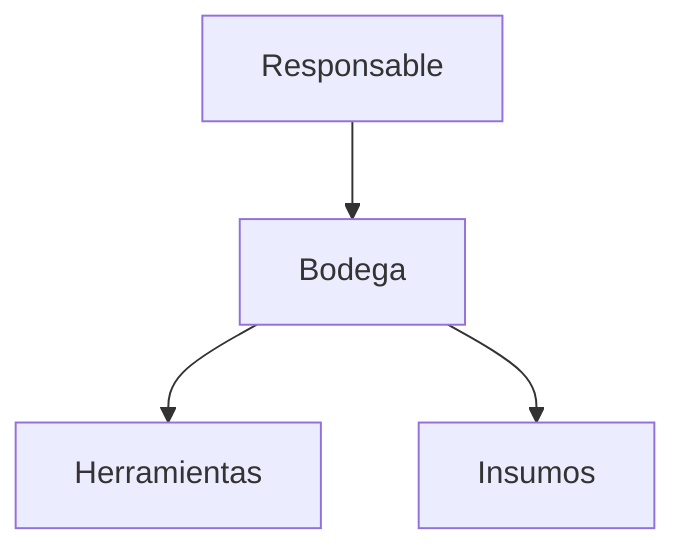

# **Gestión de Bodega**

El módulo **Bodega** permite administrar el almacenamiento de herramientas e insumos dentro de la finca. Esta documentación cubre los endpoints RESTful para su gestión.

---

## **Endpoints de la API**

### **GET /bodega**
Obtiene todas las bodegas registradas con filtros opcionales.

**Ejemplo de respuesta (200 OK):**
```json
[
  {
    "id": 1,
    "nombre": "Bodega Central",
    "ubicacion": "Sector A",
    "capacidad": 500,
    "responsable": {"id": 3, "nombre": "Juan Pérez"}
  }
]
```

**Parámetros opcionales:**
- `?ubicacion=Sector A`: Filtra por ubicación.
- `?capacidad_min=100`: Filtra bodegas con capacidad mayor o igual.
- `?capacidad_max=1000`: Filtra bodegas con capacidad menor o igual.

---

### **GET /bodega/{id}**
Obtiene una bodega específica por su ID.

**Ejemplo de respuesta (200 OK):**
```json
{
  "id": 1,
  "nombre": "Bodega Central",
  "ubicacion": "Sector A",
  "capacidad": 500,
  "responsable": {"id": 3, "nombre": "Juan Pérez"}
}
```

**Errores comunes:**
- `404 Not Found`: Si la bodega no existe.

---

### **POST /bodega**
Registra una nueva bodega.

**Ejemplo de solicitud:**
```json
{
  "nombre": "Bodega Norte",
  "ubicacion": "Sector B",
  "capacidad": 300,
  "responsable": 5
}
```

**Validaciones:**
- `nombre`, `ubicacion` y `capacidad` son obligatorios.
- `capacidad` debe ser un número positivo.

**Ejemplo de respuesta exitosa (201 Created):**
```json
{
  "id": 2,
  "message": "Bodega registrada correctamente"
}
```

**Errores comunes:**
- `400 Bad Request`: Datos inválidos o faltantes.

---

### **PUT /bodega/{id}**
Actualiza una bodega existente.

**Ejemplo de solicitud:**
```json
{
  "nombre": "Bodega Principal",
  "capacidad": 600
}
```

**Restricciones:**
- No se puede modificar la `ubicacion` después de creada.

**Ejemplo de respuesta (200 OK):**
```json
{
  "id": 1,
  "message": "Bodega actualizada correctamente"
}
```

---

### **DELETE /bodega/{id}**
Elimina una bodega del inventario.

**Ejemplo de respuesta exitosa (200 OK):**
```json
{
  "message": "Bodega eliminada correctamente"
}
```

**Errores comunes:**
- `404 Not Found`: Si la bodega no existe.
- `409 Conflict`: Si la bodega tiene herramientas o insumos asociados.

---

## **Manejo de Errores**

### **Ejemplo de error (bodega con elementos asociados):**
```json
{
  "error": "Conflict",
  "detail": "No se puede eliminar la bodega porque tiene herramientas o insumos asignados."
}
```

### **Códigos de estado comunes:**
| Código | Descripción |
|--------|-------------|
| `200` | OK (GET, PUT, DELETE exitoso) |
| `201` | Created (POST exitoso) |
| `400` | Bad Request (datos inválidos) |
| `404` | Not Found (bodega no encontrada) |
| `409` | Conflict (restricción de integridad) |

---

## **Relaciones en el Sistema**

Los registros de **Bodegas** están vinculados con:
- **Responsables** (cada bodega tiene un encargado asignado).
- **Herramientas e Insumos** (almacenados y gestionados dentro de cada bodega).



---

## **Buenas Prácticas**
✔️ **Registro actualizado**: Mantener la información de las bodegas actualizada en cuanto a capacidad y ubicación.  
✔️ **Verificación de capacidad**: Asegurar que el almacenamiento no exceda la capacidad registrada.  
✔️ **Asignación de responsables**: Cada bodega debe tener un responsable asignado para su gestión y control.  

---

## **Integraciones Comunes**

▸ **Inventario de Herramientas**: Registro automático de herramientas almacenadas en cada bodega.  
▸ **Control de Insumos**: Seguimiento de entradas y salidas de insumos.  
▸ **Reportes**: Generación de informes sobre capacidad utilizada y disponibilidad.  
