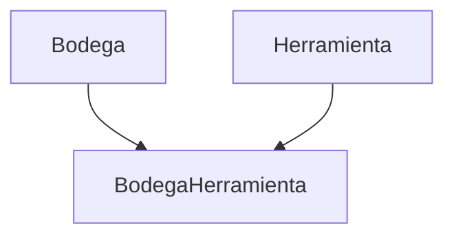

# **Gestión de Bodega Herramienta**

Los **registros de Bodega Herramienta** documentan la relación entre herramientas y bodegas, incluyendo la cantidad disponible de cada herramienta en una bodega específica. Esta documentación cubre los endpoints RESTful y las conexiones WebSocket para su gestión.

---

## **Endpoints de la API**

### **GET /inventario/bodega_herramienta/**
Obtiene todas las relaciones entre bodegas y herramientas registradas.

**Ejemplo de respuesta (200 OK):**
```json
[
  {
    "id": 1,
    "bodega": 1,
    "herramienta": 2,
    "cantidad": 5
  }
]
```

**Parámetros opcionales:**
- `?bodega=1`: Filtra por ID de bodega
- `?herramienta=2`: Filtra por ID de herramienta

---

### **GET /inventario/bodega_herramienta/{id}/**
Obtiene una relación específica entre bodega y herramienta por su ID.

**Ejemplo de respuesta (200 OK):**
```json
{
  "id": 1,
  "bodega": 1,
  "herramienta": 2,
  "cantidad": 5
}
```

---

### **POST /inventario/bodega_herramienta/**
Registra una nueva relación entre una bodega y una herramienta.

**Ejemplo de solicitud:**
```json
{
  "bodega": 1,
  "herramienta": 2,
  "cantidad": 3
}
```

**Validaciones:**
- Campos obligatorios: `bodega`, `herramienta`
- `cantidad` debe ser un entero positivo (≥ 1)

**Respuesta exitosa (201 Created):**
```json
{
  "id": 2,
  "bodega": 1,
  "herramienta": 2,
  "cantidad": 3
}
```

---

### **PUT /inventario/bodega_herramienta/{id}/**
Actualiza una relación existente entre bodega y herramienta.

**Ejemplo de solicitud:**
```json
{
  "cantidad": 4
}
```

**Restricciones:**
- Solo se puede modificar `cantidad`

---

### **DELETE /inventario/bodega_herramienta/{id}/**
Elimina una relación entre bodega y herramienta.

**Respuesta exitosa (204 No Content):**
```json
{}
```

**Error común (404 Not Found):**
```json
{
  "detail": "No encontrado."
}
```

---

## **WebSocket**

**Conexión:** `ws/inventario/bodega_herramienta/`

Permite actualizaciones en tiempo real de las relaciones entre bodegas y herramientas.

### **Estado inicial:**
```json
{
  "action": "initial_state",
  "data": [
    {
      "id": 1,
      "bodega": "Bodega Central",
      "herramienta": "Martillo",
      "cantidad": 5
    }
  ],
  "message_id": "uuid-aqui"
}
```

### **Eventos en tiempo real:**

#### **Creación/Actualización:**
```json
{
  "id": 1,
  "bodega": "Bodega Central",
  "herramienta": "Martillo",
  "cantidad": 5,
  "accion": "create"
}
```

#### **Eliminación:**
```json
{
  "id": 1,
  "accion": "delete"
}
```

---

## **Relaciones en el Sistema**



---

## **Códigos de estado comunes:**

| Código | Descripción |
|--------|-------------|
| `200` | OK (GET, PUT, DELETE exitoso) |
| `201` | Created (POST exitoso) |
| `400` | Bad Request (datos inválidos) |
| `404` | Not Found (relación no encontrada) |
| `409` | Conflict (restricción de integridad) |

---

## **Buenas Prácticas**
- **Registro inmediato:** Actualizar la cantidad tras cada movimiento de herramientas.
- **Detalles específicos:** Verificar que la cantidad coincida con el inventario físico.
- **Sincronización:** Usar WebSocket para reflejar cambios en tiempo real en el frontend.

---

## **Integraciones Comunes**
- **Notificaciones:** Alertas cuando la cantidad de herramientas cae por debajo de un umbral.
- **Inventario:** Actualización automática del stock en `Herramienta` al modificar `BodegaHerramienta`.
- **Reportes:**
  - Disponibilidad por bodega
  - Histórico de movimientos de herramientas

