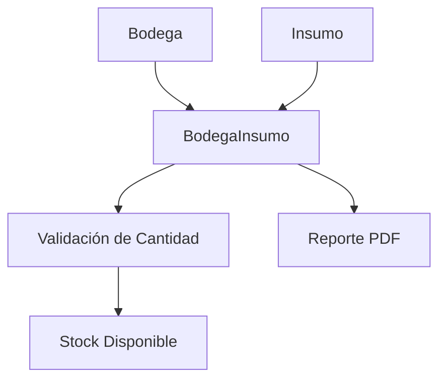

# **Gestión de Bodega Insumo**

Los **registros de Bodega Insumo** documentan la relación entre insumos y bodegas, incluyendo la cantidad disponible de cada insumo en una bodega específica. Esta documentación cubre los endpoints RESTful para su gestión completa.

---

## **Endpoints de la API**

### **Obtener todas las relaciones entre bodegas e insumos**

<p><strong>Método:</strong> <span class="sl-badge success small astro-avdet4wd">GET</span></p>

URL:
<section id="tab-panel-58" aria-labelledby="tab-58" role="tabpanel">
  <div class="expressive-code">
    <figure class="frame not-content">
      <pre data-language="http" tabindex="0"><code><div class="ec-line"><div class="code">http://127.0.0.1:8000/inventario/bodega_insumo/</div></div></code></pre>
      <div class="copy"><button title="Copiar al portapapeles" data-copied="¡Copiado!" data-code="http://127.0.0.1:8000/inventario/bodega_insumo/"><div></div></button></div>
    </figure>
  </div>
</section>

**Parámetros opcionales:**
- `?bodega=1`: Filtra por ID de bodega.
- `?insumo=2`: Filtra por ID de insumo.

**Ejemplo de respuesta (200 OK):**
```json
[
  {
    "id": 1,
    "bodega": 1,
    "insumo": 2,
    "cantidad": 10
  }
]
```

---

### **Obtener una relación específica por ID**

<p><strong>Método:</strong> <span class="sl-badge success small astro-avdet4wd">GET</span></p>

URL:
<section id="tab-panel-58" aria-labelledby="tab-58" role="tabpanel">
  <div class="expressive-code">
    <figure class="frame not-content">
      <pre data-language="http" tabindex="0"><code><div class="ec-line"><div class="code">http://127.0.0.1:8000/inventario/bodega_insumo/{id}/</div></div></code></pre>
      <div class="copy"><button title="Copiar al portapapeles" data-copied="¡Copiado!" data-code="http://127.0.0.1:8000/inventario/bodega_insumo/{id}/"><div></div></button></div>
    </figure>
  </div>
</section>

**Ejemplo de respuesta (200 OK):**
```json
{
  "id": 1,
  "bodega": 1,
  "insumo": 2,
  "cantidad": 10
}
```

---

### **Registrar una nueva relación entre bodega e insumo**

<p><strong>Método:</strong> <span class="sl-badge success small astro-avdet4wd">POST</span></p>

URL:
<section id="tab-panel-58" aria-labelledby="tab-58" role="tabpanel">
  <div class="expressive-code">
    <figure class="frame not-content">
      <pre data-language="http" tabindex="0"><code><div class="ec-line"><div class="code">http://127.0.0.1:8000/inventario/bodega_insumo/</div></div></code></pre>
      <div class="copy"><button title="Copiar al portapapeles" data-copied="¡Copiado!" data-code="http://127.0.0.1:8000/inventario/bodega_insumo/"><div></div></button></div>
    </figure>
  </div>
</section>

**Ejemplo de solicitud:**
```json
{
  "bodega": 1,
  "insumo": 2,
  "cantidad": 15
}
```

**Validaciones:**
- Campos obligatorios: `bodega`, `insumo`
- `cantidad` debe ser un entero positivo
- **Nueva validación:** La cantidad no puede exceder la cantidad disponible del insumo en el inventario

**Ejemplo de respuesta exitosa (201 Created):**
```json
{
  "id": 2,
  "bodega": 1,
  "insumo": 2,
  "cantidad": 15
}
```

**Ejemplo de error de validación (400 Bad Request):**
```json
{
  "cantidad": [
    "La cantidad ingresada (20) excede la cantidad disponible (15) para el insumo Fertilizante Orgánico."
  ]
}
```

---

### **Actualizar una relación entre bodega e insumo**

<p><strong>Método:</strong> <span class="sl-badge success small astro-avdet4wd">PUT</span></p>

URL:
<section id="tab-panel-58" aria-labelledby="tab-58" role="tabpanel">
  <div class="expressive-code">
    <figure class="frame not-content">
      <pre data-language="http" tabindex="0"><code><div class="ec-line"><div class="code">http://127.0.0.1:8000/inventario/bodega_insumo/{id}/</div></div></code></pre>
      <div class="copy"><button title="Copiar al portapapeles" data-copied="¡Copiado!" data-code="http://127.0.0.1:8000/inventario/bodega_insumo/{id}/"><div></div></button></div>
    </figure>
  </div>
</section>

**Ejemplo de solicitud:**
```json
{
  "cantidad": 12
}
```

**Restricciones:**
- Solo se puede modificar `cantidad`
- **Nueva validación:** La cantidad actualizada no puede exceder la cantidad disponible del insumo más la cantidad actual en la relación

**Ejemplo de respuesta (200 OK):**
```json
{
  "id": 1,
  "bodega": 1,
  "insumo": 2,
  "cantidad": 12
}
```

---

### **Eliminar una relación entre bodega e insumo**

<p><strong>Método:</strong> <span class="sl-badge success small astro-avdet4wd">DELETE</span></p>

URL:
<section id="tab-panel-58" aria-labelledby="tab-58" role="tabpanel">
  <div class="expressive-code">
    <figure class="frame not-content">
      <pre data-language="http" tabindex="0"><code><div class="ec-line"><div class="code">http://127.0.0.1:8000/inventario/bodega_insumo/{id}/</div></div></code></pre>
      <div class="copy"><button title="Copiar al portapapeles" data-copied="¡Copiado!" data-code="http://127.0.0.1:8000/inventario/bodega_insumo/{id}/"><div></div></button></div>
    </figure>
  </div>
</section>

**Ejemplo de respuesta exitosa (204 No Content):**
```json
{}
```

---

### **Generar reporte PDF de bodega de insumos**

<p><strong>Método:</strong> <span class="sl-badge success small astro-avdet4wd">GET</span></p>

URL:
<section id="tab-panel-58" aria-labelledby="tab-58" role="tabpanel">
  <div class="expressive-code">
    <figure class="frame not-content">
      <pre data-language="http" tabindex="0"><code><div class="ec-line"><div class="code">http://127.0.0.1:8000/inventario/bodega_insumo/reporte_pdf/</div></div></code></pre>
      <div class="copy"><button title="Copiar al portapapeles" data-copied="¡Copiado!" data-code="http://127.0.0.1:8000/inventario/bodega_insumo/reporte_pdf/"><div></div></button></div>
    </figure>
  </div>
</section>

**Descripción:** 
Genera un reporte completo en formato PDF con el inventario de insumos por bodega.

**Descripción:**
Genera un reporte PDF completo con el inventario de insumos por bodega, incluyendo:
- Información detallada de cada relación bodega-insumo
- Resumen estadístico del inventario
- Formato profesional con logotipo empresarial

**Headers requeridos:**
```http
Authorization: Bearer <jwt_token>
```

**Ejemplo de respuesta:**
- **Content-Type:** `application/pdf`
- **Content-Disposition:** `attachment; filename="reporte_bodega_insumos.pdf"`

**Contenido del PDF:**
- Encabezado con logo de la empresa
- Fecha de generación del reporte
- Objetivo del documento
- Tabla detallada con ID, Bodega, Insumo y Cantidad
- Resumen general con totales

---

## **Manejo de Errores**

### **Ejemplo de error (404 Not Found):**
```json
{
  "detail": "No encontrado."
}
```

### **Ejemplo de error (400 Bad Request):**
```json
{
  "error": "Bad Request",
  "detail": "El campo 'cantidad' debe ser un entero."
}
```

### **Ejemplo de error de validación de cantidad:**
```json
{
  "cantidad": [
    "La cantidad ingresada (25) excede la cantidad disponible (20) para el insumo Pesticida Natural."
  ]
}
```

### **Ejemplo de error de autenticación (401 Unauthorized):**
```json
{
  "detail": "No se han proporcionado las credenciales de autenticación."
}
```

---

## **Buenas Prácticas**

✔️ **Registro inmediato:** Actualizar la cantidad tras cada movimiento de insumos.  
✔️ **Validación de inventario:** Asegurar que las cantidades asignadas no excedan el stock disponible.  
✔️ **Detalles específicos:** Verificar que la cantidad coincida con el inventario físico.  
✔️ **Reportes regulares:** Generar reportes PDF periódicamente para auditoría.  
✔️ **Seguridad:** Mantener tokens JWT actualizados y seguros.  
✔️ **Trazabilidad:** Documentar todas las asignaciones y movimientos de insumos por bodega.

---

## **Integraciones Comunes**

▸ **Notificaciones:** Alertas cuando la cantidad de insumos cae por debajo de un umbral.  
▸ **Inventario:** Actualización automática del stock en `Insumo` al modificar `BodegaInsumo`.  
▸ **Validación cruzada:** Verificación automática de disponibilidad antes de asignaciones.  
▸ **Reportes:**  
    • Disponibilidad por bodega  
    • Histórico de movimientos de insumos  
    • Reportes PDF automatizados con logo empresarial  
▸ **Auditoría:** Registro de cambios con validaciones de integridad de inventario.

---

## **Relaciones Clave**


---

## **Casos de Uso Ejemplos**

### **Escenario 1: Asignación válida**
```json
{
  "bodega": 1,
  "insumo": 3,
  "cantidad": 20  
}
```

### **Escenario 2: Asignación inválida**
```json
/
{
  "bodega": 1,
  "insumo": 3,
  "cantidad": 25 
}
```

### **Escenario 3: Actualización con cantidad previa**
```json
{
  "cantidad": 35
}
```

---

## **Configuración de Autenticación**

**Requerido:** JWT Authentication  
**Permisos:** IsAuthenticated  
**Headers necesarios:**
```http
Authorization: Bearer <jwt_token>
Content-Type: application/json
```