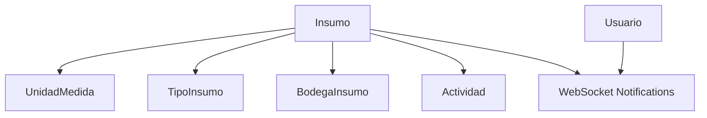

# **Gestión de Insumos**

Los **registros de Insumos** documentan los insumos disponibles en el inventario, incluyendo su nombre, descripción, cantidad, unidad de medida, tipo de insumo, tipo empacado, fechas y precios. Esta documentación cubre los endpoints RESTful para su gestión completa.

---

## **Endpoints de la API**

### **Obtener todos los insumos**

<p><strong>Método:</strong> <span class="sl-badge success small astro-avdet4wd">GET</span></p>

URL:
<section id="tab-panel-58" aria-labelledby="tab-58" role="tabpanel">
  <div class="expressive-code">
    <figure class="frame not-content">
      <pre data-language="http" tabindex="0"><code><div class="ec-line"><div class="code">http://127.0.0.1:8000/inventario/insumo/</div></div></code></pre>
      <div class="copy"><button title="Copiar al portapapeles" data-copied="¡Copiado!" data-code="http://127.0.0.1:8000/inventario/insumo/"><div></div></button></div>
    </figure>
  </div>
</section>

**Parámetros opcionales:**
- `?nombre=Fertilizante`: Filtra por nombre de insumo.
- `?activo=true`: Filtra por insumos activos.
- `?tipo_insumo=1`: Filtra por tipo de insumo.
- `?unidad_medida=2`: Filtra por unidad de medida.

**Ejemplo de respuesta (200 OK):**
```json
[
  {
    "id": 1,
    "nombre": "Fertilizante NPK",
    "descripcion": "Fertilizante balanceado para cultivos de hortalizas",
    "cantidad": 50,
    "unidad_medida": {
      "id": 1,
      "nombre": "kg",
      "descripcion": "Kilogramo",
      "creada_por_usuario": false
    },
    "tipo_insumo": {
      "id": 1,
      "nombre": "Fertilizante",
      "descripcion": "Insumos para nutrición de plantas",
      "creada_por_usuario": false
    },
    "activo": true,
    "tipo_empacado": "Saco de 25kg",
    "fecha_registro": "2024-01-15T10:30:00Z",
    "fecha_caducidad": "2025-12-31",
    "precio_insumo": "45000.00"
  }
]
```

---

### **Obtener un insumo por ID**

<p><strong>Método:</strong> <span class="sl-badge success small astro-avdet4wd">GET</span></p>

URL:
<section id="tab-panel-58" aria-labelledby="tab-58" role="tabpanel">
  <div class="expressive-code">
    <figure class="frame not-content">
      <pre data-language="http" tabindex="0"><code><div class="ec-line"><div class="code">http://127.0.0.1:8000/inventario/insumo/{id}/</div></div></code></pre>
      <div class="copy"><button title="Copiar al portapapeles" data-copied="¡Copiado!" data-code="http://127.0.0.1:8000/inventario/insumo/{id}/"><div></div></button></div>
    </figure>
  </div>
</section>

**Ejemplo de respuesta (200 OK):**
```json
{
  "id": 1,
  "nombre": "Fertilizante NPK",
  "descripcion": "Fertilizante balanceado para cultivos de hortalizas",
  "cantidad": 50,
  "unidad_medida": {
    "id": 1,
    "nombre": "kg",
    "descripcion": "Kilogramo",
    "creada_por_usuario": false
  },
  "tipo_insumo": {
    "id": 1,
    "nombre": "Fertilizante",
    "descripcion": "Insumos para nutrición de plantas",
    "creada_por_usuario": false
  },
  "activo": true,
  "tipo_empacado": "Saco de 25kg",
  "fecha_registro": "2024-01-15T10:30:00Z",
  "fecha_caducidad": "2025-12-31",
  "precio_insumo": "45000.00"
}
```

---

### **Registrar un nuevo insumo**

<p><strong>Método:</strong> <span class="sl-badge success small astro-avdet4wd">POST</span></p>

URL:
<section id="tab-panel-58" aria-labelledby="tab-58" role="tabpanel">
  <div class="expressive-code">
    <figure class="frame not-content">
      <pre data-language="http" tabindex="0"><code><div class="ec-line"><div class="code">http://127.0.0.1:8000/inventario/insumo/</div></div></code></pre>
      <div class="copy"><button title="Copiar al portapapeles" data-copied="¡Copiado!" data-code="http://127.0.0.1:8000/inventario/insumo/"><div></div></button></div>
    </figure>
  </div>
</section>

**Ejemplo de solicitud:**
```json
{
  "nombre": "Pesticida Orgánico",
  "descripcion": "Pesticida orgánico para control de plagas",
  "cantidad": 20,
  "unidad_medida": 2,
  "tipo_insumo": 3,
  "activo": true,
  "tipo_empacado": "Botella de 1L",
  "fecha_caducidad": "2025-06-30",
  "precio_insumo": "35000.00"
}
```

**Validaciones:**
- Campos obligatorios: `nombre`, `descripcion`, `cantidad`
- `cantidad` debe ser un entero positivo
- `unidad_medida` debe ser un ID válido de UnidadMedida (opcional)
- `tipo_insumo` debe ser un ID válido de TipoInsumo (opcional)
- `precio_insumo` debe ser un decimal válido (por defecto 0.00)
- `activo` es opcional (por defecto `true`)
- `fecha_caducidad` debe estar en formato YYYY-MM-DD (opcional)

**Ejemplo de respuesta (201 Created):**
```json
{
  "id": 2,
  "nombre": "Pesticida Orgánico",
  "descripcion": "Pesticida orgánico para control de plagas",
  "cantidad": 20,
  "unidad_medida": {
    "id": 2,
    "nombre": "litros",
    "descripcion": "Litro",
    "creada_por_usuario": false
  },
  "tipo_insumo": {
    "id": 3,
    "nombre": "Pesticida",
    "descripcion": "Productos para control de plagas",
    "creada_por_usuario": false
  },
  "activo": true,
  "tipo_empacado": "Botella de 1L",
  "fecha_registro": "2024-01-16T14:22:00Z",
  "fecha_caducidad": "2025-06-30",
  "precio_insumo": "35000.00"
}
```

---

### **Actualizar un insumo**

<p><strong>Método:</strong> <span class="sl-badge success small astro-avdet4wd">PUT</span></p>

URL:
<section id="tab-panel-58" aria-labelledby="tab-58" role="tabpanel">
  <div class="expressive-code">
    <figure class="frame not-content">
      <pre data-language="http" tabindex="0"><code><div class="ec-line"><div class="code">http://127.0.0.1:8000/inventario/insumo/{id}/</div></div></code></pre>
      <div class="copy"><button title="Copiar al portapapeles" data-copied="¡Copiado!" data-code="http://127.0.0.1:8000/inventario/insumo/{id}/"><div></div></button></div>
    </figure>
  </div>
</section>

**Ejemplo de solicitud:**
```json
{
  "cantidad": 15,
  "activo": false,
  "precio_insumo": "48000.00",
  "fecha_caducidad": "2025-10-15"
}
```

**Restricciones:**
- Todos los campos son modificables
- Las relaciones con `unidad_medida` y `tipo_insumo` se pueden actualizar con IDs válidos
- `fecha_registro` se actualiza automáticamente al momento de la creación

**Ejemplo de respuesta (200 OK):**
```json
{
  "id": 1,
  "nombre": "Fertilizante NPK",
  "descripcion": "Fertilizante balanceado para cultivos de hortalizas",
  "cantidad": 15,
  "unidad_medida": {
    "id": 1,
    "nombre": "kg",
    "descripcion": "Kilogramo",
    "creada_por_usuario": false
  },
  "tipo_insumo": {
    "id": 1,
    "nombre": "Fertilizante",
    "descripcion": "Insumos para nutrición de plantas",
    "creada_por_usuario": false
  },
  "activo": false,
  "tipo_empacado": "Saco de 25kg",
  "fecha_registro": "2024-01-15T10:30:00Z",
  "fecha_caducidad": "2025-10-15",
  "precio_insumo": "48000.00"
}
```

---

### **Eliminar un insumo**

<p><strong>Método:</strong> <span class="sl-badge success small astro-avdet4wd">DELETE</span></p>

URL:
<section id="tab-panel-58" aria-labelledby="tab-58" role="tabpanel">
  <div class="expressive-code">
    <figure class="frame not-content">
      <pre data-language="http" tabindex="0"><code><div class="ec-line"><div class="code">http://127.0.0.1:8000/inventario/insumo/{id}/</div></div></code></pre>
      <div class="copy"><button title="Copiar al portapapeles" data-copied="¡Copiado!" data-code="http://127.0.0.1:8000/inventario/insumo/{id}/"><div></div></button></div>
    </figure>
  </div>
</section>

**Ejemplo de respuesta exitosa (204 No Content):**
```json
{}
```

---

### **Usar insumo en actividad**

<p><strong>Método:</strong> <span class="sl-badge success small astro-avdet4wd">POST</span></p>

URL:
<section id="tab-panel-58" aria-labelledby="tab-58" role="tabpanel">
  <div class="expressive-code">
    <figure class="frame not-content">
      <pre data-language="http" tabindex="0"><code><div class="ec-line"><div class="code">http://127.0.0.1:8000/inventario/insumo/{id}/usar_en_actividad/</div></div></code></pre>
      <div class="copy"><button title="Copiar al portapapeles" data-copied="¡Copiado!" data-code="http://127.0.0.1:8000/inventario/insumo/{id}/usar_en_actividad/"><div></div></button></div>
    </figure>
  </div>
</section>

**Ejemplo de solicitud:**
```json
{
  "cantidad_usada": 5,
  "actividad_id": 12
}
```

**Validaciones:**
- `cantidad_usada` debe ser mayor a 0
- `cantidad_usada` no puede exceder la cantidad disponible del insumo
- `actividad_id` es opcional, si se proporciona debe existir
- Si se proporciona `actividad_id`, el insumo debe coincidir con el de la actividad

**Ejemplo de respuesta (200 OK):**
```json
{
  "mensaje": "Insumo Fertilizante NPK descontado (5 unidades) y vinculado a la actividad 12.",
  "cantidad_restante": 45
}
```

---

## **Endpoints de Unidades de Medida**

### **Obtener todas las unidades de medida**

<p><strong>Método:</strong> <span class="sl-badge success small astro-avdet4wd">GET</span></p>

URL:
<section id="tab-panel-58" aria-labelledby="tab-58" role="tabpanel">
  <div class="expressive-code">
    <figure class="frame not-content">
      <pre data-language="http" tabindex="0"><code><div class="ec-line"><div class="code">http://127.0.0.1:8000/inventario/insumo/unidades_medida/</div></div></code></pre>
      <div class="copy"><button title="Copiar al portapapeles" data-copied="¡Copiado!" data-code="http://127.0.0.1:8000/inventario/insumo/unidades_medida/"><div></div></button></div>
    </figure>
  </div>
</section>

**Ejemplo de respuesta (200 OK):**
```json
[
  {
    "id": 1,
    "nombre": "kg",
    "descripcion": "Kilogramo",
    "creada_por_usuario": false,
    "fecha_creacion": "2024-01-01T00:00:00Z"
  },
  {
    "id": 2,
    "nombre": "litros",
    "descripcion": "Litro",
    "creada_por_usuario": false,
    "fecha_creacion": "2024-01-01T00:00:00Z"
  }
]
```

---

### **Crear una nueva unidad de medida**

<p><strong>Método:</strong> <span class="sl-badge success small astro-avdet4wd">POST</span></p>

URL:
<section id="tab-panel-58" aria-labelledby="tab-58" role="tabpanel">
  <div class="expressive-code">
    <figure class="frame not-content">
      <pre data-language="http" tabindex="0"><code><div class="ec-line"><div class="code">http://127.0.0.1:8000/inventario/insumo/crear_unidad_medida/</div></div></code></pre>
      <div class="copy"><button title="Copiar al portapapeles" data-copied="¡Copiado!" data-code="http://127.0.0.1:8000/inventario/insumo/crear_unidad_medida/"><div></div></button></div>
    </figure>
  </div>
</section>

**Ejemplo de solicitud:**
```json
{
  "nombre": "gramos",
  "descripcion": "Gramo para mediciones pequeñas"
}
```

**Validaciones:**
- `nombre` debe ser único y obligatorio (máximo 50 caracteres)
- `descripcion` es opcional
- `creada_por_usuario` se marca automáticamente como `true`

**Ejemplo de respuesta (201 Created):**
```json
{
  "id": 3,
  "nombre": "gramos",
  "descripcion": "Gramo para mediciones pequeñas",
  "creada_por_usuario": true,
  "fecha_creacion": "2024-01-16T14:30:00Z"
}
```

---

## **Endpoints de Tipos de Insumo**

### **Obtener todos los tipos de insumo**

<p><strong>Método:</strong> <span class="sl-badge success small astro-avdet4wd">GET</span></p>

URL:
<section id="tab-panel-58" aria-labelledby="tab-58" role="tabpanel">
  <div class="expressive-code">
    <figure class="frame not-content">
      <pre data-language="http" tabindex="0"><code><div class="ec-line"><div class="code">http://127.0.0.1:8000/inventario/insumo/tipos_insumo/</div></div></code></pre>
      <div class="copy"><button title="Copiar al portapapeles" data-copied="¡Copiado!" data-code="http://127.0.0.1:8000/inventario/insumo/tipos_insumo/"><div></div></button></div>
    </figure>
  </div>
</section>

**Ejemplo de respuesta (200 OK):**
```json
[
  {
    "id": 1,
    "nombre": "Fertilizante",
    "descripcion": "Insumos para nutrición de plantas",
    "creada_por_usuario": false,
    "fecha_creacion": "2024-01-01T00:00:00Z"
  },
  {
    "id": 2,
    "nombre": "Pesticida",
    "descripcion": "Productos para control de plagas",
    "creada_por_usuario": false,
    "fecha_creacion": "2024-01-01T00:00:00Z"
  }
]
```

---

### **Crear un nuevo tipo de insumo**

<p><strong>Método:</strong> <span class="sl-badge success small astro-avdet4wd">POST</span></p>

URL:
<section id="tab-panel-58" aria-labelledby="tab-58" role="tabpanel">
  <div class="expressive-code">
    <figure class="frame not-content">
      <pre data-language="http" tabindex="0"><code><div class="ec-line"><div class="code">http://127.0.0.1:8000/inventario/insumo/crear_tipo_insumo/</div></div></code></pre>
      <div class="copy"><button title="Copiar al portapapeles" data-copied="¡Copiado!" data-code="http://127.0.0.1:8000/inventario/insumo/crear_tipo_insumo/"><div></div></button></div>
    </figure>
  </div>
</section>

**Ejemplo de solicitud:**
```json
{
  "nombre": "Herbicida",
  "descripcion": "Productos para control de malezas"
}
```

**Validaciones:**
- `nombre` debe ser único y obligatorio (máximo 50 caracteres)
- `descripcion` es opcional
- `creada_por_usuario` se marca automáticamente como `true`

**Ejemplo de respuesta (201 Created):**
```json
{
  "id": 3,
  "nombre": "Herbicida",
  "descripcion": "Productos para control de malezas",
  "creada_por_usuario": true,
  "fecha_creacion": "2024-01-16T14:35:00Z"
}
```

---

## **Endpoints de Reportes y Notificaciones**

### **Generar reporte PDF de insumos**

<p><strong>Método:</strong> <span class="sl-badge success small astro-avdet4wd">GET</span></p>

URL:
<section id="tab-panel-58" aria-labelledby="tab-58" role="tabpanel">
  <div class="expressive-code">
    <figure class="frame not-content">
      <pre data-language="http" tabindex="0"><code><div class="ec-line"><div class="code">http://127.0.0.1:8000/inventario/insumo/reporte_pdf/</div></div></code></pre>
      <div class="copy"><button title="Copiar al portapapeles" data-copied="¡Copiado!" data-code="http://127.0.0.1:8000/inventario/insumo/reporte_pdf/"><div></div></button></div>
    </figure>
  </div>
</section>

**Descripción:**
Genera un reporte PDF completo con todos los insumos registrados, incluyendo:
- Información detallada de cada insumo
- Resumen estadístico del inventario
- Formato profesional con logotipo empresarial

**Ejemplo de respuesta:**
- **Content-Type:** `application/pdf`
- **Content-Disposition:** `attachment; filename="reporte_insumos.pdf"`

---

### **Marcar notificación como leída**

<p><strong>Método:</strong> <span class="sl-badge success small astro-avdet4wd">POST</span></p>

URL:
<section id="tab-panel-58" aria-labelledby="tab-58" role="tabpanel">
  <div class="expressive-code">
    <figure class="frame not-content">
      <pre data-language="http" tabindex="0"><code><div class="ec-line"><div class="code">http://127.0.0.1:8000/inventario/insumo/mark_notification_read/</div></div></code></pre>
      <div class="copy"><button title="Copiar al portapapeles" data-copied="¡Copiado!" data-code="http://127.0.0.1:8000/inventario/insumo/mark_notification_read/"><div></div></button></div>
    </figure>
  </div>
</section>

**Ejemplo de solicitud:**
```json
{
  "id": "abc123def456"
}
```

**Ejemplo de respuesta (200 OK):**
```json
{
  "status": "success"
}
```

---

## **WebSocket - Notificaciones en Tiempo Real**

### **Conexión WebSocket**

URL:
<section id="tab-panel-58" aria-labelledby="tab-58" role="tabpanel">
  <div class="expressive-code">
    <figure class="frame not-content">
      <pre data-language="websocket" tabindex="0"><code><div class="ec-line"><div class="code">ws://127.0.0.1:8000/ws/insumo/{user_id}/</div></div></code></pre>
      <div class="copy"><button title="Copiar al portapapeles" data-copied="¡Copiado!" data-code="ws://127.0.0.1:8000/ws/insumo/{user_id}/"><div></div></button></div>
    </figure>
  </div>
</section>

**Tipos de notificaciones:**
- **low_stock**: Cuando un insumo tiene cantidad ≤ 10 unidades
- **expiring**: Cuando un insumo está próximo a vencer (≤ 7 días)

**Ejemplo de notificación recibida:**
```json
{
  "id": "abc123def456",
  "type": "low_stock",
  "message": "El insumo Fertilizante NPK está bajo en stock: 8 kg restantes.",
  "timestamp": "1642323456789",
  "insumo_id": 1,
  "source": "bodega"
}
```

---

## **Manejo de Errores**

### **Ejemplo de error (404 Not Found):**
```json
{
  "detail": "No encontrado."
}
```

### **Ejemplo de error (400 Bad Request):**
```json
{
  "error": "Bad Request",
  "detail": "El campo 'cantidad' debe ser un entero positivo."
}
```

### **Ejemplo de error de stock insuficiente:**
```json
{
  "error": "No hay suficiente stock del insumo Fertilizante NPK. Disponible: 5"
}
```

### **Ejemplo de error de validación en actividad:**
```json
{
  "error": "El insumo Pesticida no coincide con el insumo de la actividad 12."
}
```

---

## **Buenas Prácticas**

✔️ **Registro completo:** Incluir siempre `unidad_medida` y `tipo_insumo` para mejor organización.  
✔️ **Fechas de caducidad:** Registrar `fecha_caducidad` para productos perecederos.  
✔️ **Precios actualizados:** Mantener `precio_insumo` actualizado para análisis de costos.  
✔️ **Tipos de empacado:** Especificar `tipo_empacado` para facilitar el control de inventario.  
✔️ **Uso en actividades:** Vincular el uso de insumos con actividades específicas para trazabilidad.  
✔️ **Monitoreo en tiempo real:** Utilizar WebSocket para recibir alertas de stock bajo y vencimientos.

---

## **Integraciones Comunes**

▸ **Notificaciones:** Alertas automáticas por WebSocket cuando:  
    • Stock bajo (≤ 10 unidades)  
    • Proximidad de vencimiento (≤ 7 días)  
▸ **Inventario:** Sincronización con `BodegaInsumo` para reflejar disponibilidad por bodega.  
▸ **Actividades:** Vinculación directa con `Actividad` para control de uso y trazabilidad.  
▸ **Reportes:**  
    • Stock por unidad de medida  
    • Histórico de uso y reabastecimiento  
    • Análisis de costos por tipo de insumo  
    • Alertas de vencimiento próximo

---

## **Relaciones Clave**


---

## **Configuración de Autenticación**

**Requerido:** JWT Authentication  
**Permisos:** IsAuthenticated + PermisoPorRol  
**Headers necesarios:**
```http
Authorization: Bearer <jwt_token>
Content-Type: application/json
```