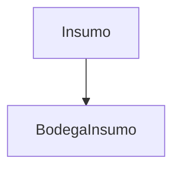

# **Gestión de Insumos**

Los **registros de Insumos** documentan los insumos disponibles en el inventario, incluyendo su nombre, descripción, cantidad, unidad de medida y si están activos. Esta documentación cubre los endpoints RESTful para su gestión.

---

## **Endpoints de la API**

### **GET /inventario/insumo/**
Obtiene todos los insumos registrados.

**Ejemplo de respuesta (200 OK):**
```json
[
  {
    "id": 1,
    "nombre": "Fertilizante NPK",
    "descripcion": "Fertilizante balanceado para cultivos",
    "cantidad": 50,
    "unidad_medida": "kg",
    "activo": true
  }
]
```

**Parámetros opcionales:**
- `?nombre=Fertilizante`: Filtra por nombre de insumo
- `?activo=true`: Filtra por insumos activos

---

### **GET /inventario/insumo/{id}/**
Obtiene un insumo específico por su ID.

**Ejemplo de respuesta (200 OK):**
```json
{
  "id": 1,
  "nombre": "Fertilizante NPK",
  "descripcion": "Fertilizante balanceado para cultivos",
  "cantidad": 50,
  "unidad_medida": "kg",
  "activo": true
}
```

---

### **POST /inventario/insumo/**
Registra un nuevo insumo en el inventario.

**Ejemplo de solicitud:**
```json
{
  "nombre": "Pesticida",
  "descripcion": "Pesticida orgánico para plagas",
  "cantidad": 20,
  "unidad_medida": "litros",
  "activo": true
}
```

**Validaciones:**
- Campos obligatorios: `nombre`, `descripcion`, `cantidad`, `unidad_medida`
- `cantidad` debe ser un entero
- `activo` es opcional (por defecto `true`)

**Respuesta exitosa (201 Created):**
```json
{
  "id": 2,
  "nombre": "Pesticida",
  "descripcion": "Pesticida orgánico para plagas",
  "cantidad": 20,
  "unidad_medida": "litros",
  "activo": true
}
```

---

### **PUT /inventario/insumo/{id}/**
Actualiza un insumo existente.

**Ejemplo de solicitud:**
```json
{
  "cantidad": 15,
  "activo": false
}
```

**Restricciones:**
- Todos los campos son modificables

---

### **DELETE /inventario/insumo/{id}/**
Elimina un insumo del inventario.

**Respuesta exitosa (204 No Content):**
```json
{}
```

**Error común (404 Not Found):**
```json
{
  "detail": "No encontrado."
}
```

---

## **Códigos de estado comunes:**
| Código | Descripción |
|--------|-------------|
| `200` | OK (GET, PUT, DELETE exitoso) |
| `201` | Created (POST exitoso) |
| `204` | No Content (DELETE exitoso) |
| `400` | Bad Request (datos inválidos) |
| `404` | Not Found (insumo no encontrado) |

---

## **Relaciones Clave**


---

## **Buenas Prácticas**
✔️ **Registro inmediato:** Actualizar la cantidad tras cada uso o reabastecimiento.  
✔️ **Detalles específicos:** Incluir en `descripcion` el tipo o propósito del insumo.  
✔️ **Consistencia:** Asegurar que `unidad_medida` sea coherente con la cantidad registrada.  

---

## **Integraciones Comunes**
▸ **Notificaciones:** Alertas cuando la cantidad de insumos cae por debajo de un umbral.  
▸ **Inventario:** Sincronización con `BodegaInsumo` para reflejar disponibilidad por bodega.  
▸ **Reportes:**  
  - Stock por unidad de medida  
  - Histórico de uso y reabastecimiento  

