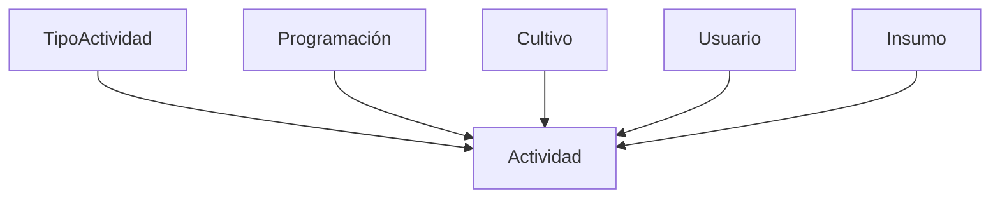

Los **registros de Actividad** documentan las labores realizadas en los cultivos (riego, fertilización, poda, etc.), incluyendo recursos utilizados, fechas y responsables. Esta documentación cubre los endpoints RESTful para su gestión.

---

## **Endpoints de la API**

### **GET /actividades**
Obtiene todas las actividades registradas con filtros opcionales.

**Ejemplo de respuesta (200 OK):**
```json
[
  {
    "id": 1,
    "tipo_actividad": {"id": 3, "nombre": "Fertilización"},
    "cultivo": {"id": 45, "nombre": "Tomate Bancal 2"},
    "fecha_inicio": "2023-11-15",
    "fecha_fin": "2023-11-15",
    "usuario": {"id": 8, "nombre": "María Gómez"},
    "insumo": {"id": 12, "nombre": "Fertilizante NPK"},
    "cantidadUsada": 5,
    "descripcion": "Aplicación en base al calendario nutricional"
  }
]
```

**Parámetros opcionales:**
- `?cultivo=45`: Filtra por ID de cultivo
- `?tipo=3`: Filtra por tipo de actividad
- `?fecha_desde=2023-11-01`: Actividades después de esta fecha
- `?fecha_hasta=2023-11-30`: Actividades antes de esta fecha

---

### **GET /actividades/{id}**
Obtiene una actividad específica por su ID.

**Ejemplo de respuesta (200 OK):**
```json
{
  "id": 1,
  "tipo_actividad": {"id": 3},
  "programacion": {"id": 22},
  "cultivo": {"id": 45},
  "fecha_inicio": "2023-11-15",
  "fecha_fin": "2023-11-15",
  "usuario": {"id": 8},
  "insumo": {"id": 12},
  "cantidadUsada": 5,
  "descripcion": "Aplicación en base al calendario nutricional"
}
```

---

### ** POST /actividades**
Registra una nueva actividad agrícola.

**Ejemplo de solicitud:**
```json
{
  "tipo_actividad": 3,
  "programacion": 22,
  "cultivo": 45,
  "fecha_inicio": "2023-11-20",
  "fecha_fin": "2023-11-20",
  "usuario": 8,
  "insumo": 12,
  "cantidadUsada": 3,
  "descripcion": "Aplicación foliar preventiva"
}
```

**Validaciones:**
- Campos obligatorios: `tipo_actividad`, `cultivo`, `fecha_inicio`, `usuario`
- `fecha_fin` no puede ser anterior a `fecha_inicio`
- `cantidadUsada` debe ser ≥ 0

**Respuesta exitosa (201 Created):**
```json
{
  "id": 2,
  "message": "Actividad registrada correctamente"
}
```

---

### **PUT /actividades/{id}**
Actualiza una actividad existente.

**Ejemplo de solicitud:**
```json
{
  "cantidadUsada": 4,
  "descripcion": "Aplicación foliar corregida por recomendación técnica"
}
```

**Restricciones:**
- No se puede modificar el `cultivo` asociado
- Campos inmutables después de creación: `tipo_actividad`, `programacion`

---

### ** DELETE /actividades/{id}**
Elimina un registro de actividad.

**Respuesta exitosa (200 OK):**
```json
{
  "message": "Actividad eliminada del historial"
}
```

**Error común (404 Not Found):**
```json
{
  "error": "No existe la actividad especificada"
}
```

---

## **Relaciones Clave**



---


## **Buenas Prácticas**

1. **Registro inmediato**: Documentar actividades el mismo día de ejecución.
2. **Detalles específicos**: En `descripcion` incluir:
   ```markdown
   - Método de aplicación (ej: "riego por goteo")
   - Condiciones climáticas (opcional)
   - Observaciones relevantes
   ```
3. **Consistencia en unidades**: Verificar que `cantidadUsada` use la misma unidad de medida que el insumo asociado.

---

## **Integraciones Comunes**

▸ **Notificaciones**: Alertas al completar actividades programadas  
▸ **Inventario**: Descuento automático de insumos utilizados  
▸ **Reportes**:  
   - Histórico por cultivo  
   - Eficiencia en uso de recursos  
   - Cumplimiento de programación